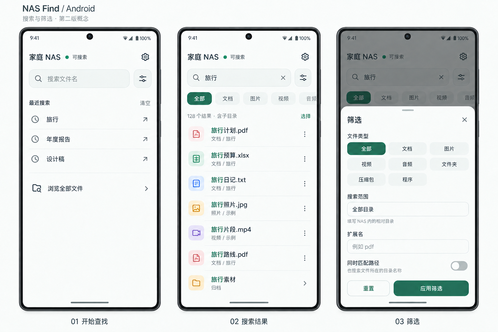
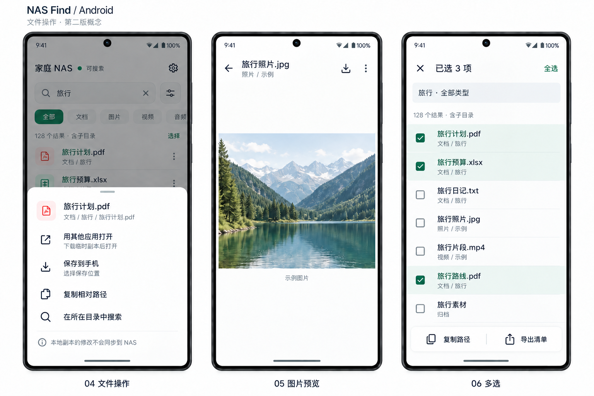

# Android 客户端产品与交互方案

历史归档：本文件记录 2026-09-09 的 Android 第二版设计提案，归档时尚未实现或安装 Android 客户端，不作为长期产品规范。图中名称、数量、历史和照片均为示例，不代表真实 NAS 数据。现有产品行为仍以[使用说明](../../usage.md)为准。

## 产品定位与首版范围

手机上的核心流程是：连接 NAS → 按名称找到文件 → 预览、保存或交给其他应用打开。继续使用服务端统一维护的文件名索引，列表只读取名称和路径。

首版规划包括单个 NAS 连接、搜索历史、分类与目录筛选、分页结果、单文件预览与保存、外部应用打开、多选复制与导出路径。暂不加入收藏、独立下载中心、多 NAS 管理、文件编辑、删除、重命名或 SMB 原文件写回。独立下载中心需要有持续管理多个下载任务的实际需求后再设计。

建议采用 Kotlin + Jetpack Compose；接口复用现有 HTTP 服务。技术选择不影响本文件中的用户行为约定，具体兼容性需要实现和设备测试后确认。

## 页面结构与设计取舍

| 元素 | 第二版决定 | 原因 |
|---|---|---|
| 主导航 | 单一搜索主页面；设置、预览为子页面 | 搜索和设置没有形成需要来回切换的并列工作区，取消底部导航 |
| 顶部 | 一行 NAS 显示名、综合状态、设置按钮 | 显示正在搜索哪个数据源；软件名称和 Logo 留给启动图标、首次连接和关于页 |
| 状态 | 主页面顶部一个状态出口 | 不再分开常驻“已连接”和“索引已就绪”；表达当前能否搜索 |
| 搜索前 | 搜索框、最近搜索、浏览全部文件 | 不用文件总量、占用空间或装饰卡片填空白；历史较多时控制首屏长度 |
| 搜索后 | 搜索框、快捷分类、已生效条件、结果列表 | 提高可见文件数；复杂条件收到筛选面板 |
| 文件行 | 文件名、相对目录、格式图标、更多操作 | 不在列表读取原文件、预生成缩略图或虚构大小日期 |
| 文件操作 | 点行预览；更多按钮打开操作面板 | 高频操作一步完成；低频操作按需展开 |
| 底部空间 | 正常浏览只保留系统安全区 | 多选时才出现批量操作栏；下载时按需出现进度条，不占用常驻导航位置 |

概念图用于确定视觉与信息层级，不是像素尺寸规范。图中的“示例图片”说明不进入真实预览页面；主页面历史不得预置图中示例内容。

## 搜索、浏览与返回

- 首次启动进入连接页。已经配置时，冷启动展示真实的最近搜索，不自动弹键盘；同一次使用中从设置、预览或其他应用返回，恢复查询、筛选和滚动位置。失效查询按下文处理，不伪装成仍有效的快照。
- 最近搜索按 NAS 配置隔离，只在本机保存最近 10 个去重的已执行非空关键词，首页最多展示 5 个，其余通过“查看全部”进入历史列表。点历史行立即执行；尾部回填箭头只填入并聚焦供修改。长按可删除单条；“清空”提供短暂撤销。设置中可关闭历史记录并清除已有历史。
- “浏览全部文件”以空关键词、默认分类和全部目录执行查询。它是递归索引结果，不是目录树；结果区显示“含子目录”。在结果中清空关键词时保留其他条件，浏览该条件下的全部结果。
- 输入停止约 300 ms 后查询；中文输入法组合文字期间不查询；键盘“搜索”立即提交并收起键盘。键盘弹出时保留已有结果，不用整页加载遮罩覆盖。
- 旧请求的延迟响应不能覆盖新关键词。搜索条件变化后取消旧查询，恢复列表顶部。拉动列表刷新只重新查询，不重建索引。
- 点文件夹表示“在此目录内搜索”：清空关键词，类型恢复全部，清除扩展名，目录范围设为该文件夹；显示可移除的目录条件及“含子目录”。返回恢复上一级查询及滚动位置。它不承诺只列出直接子文件。
- “在所在目录中搜索”保留当前关键词和其他条件，只修改目录范围；生效条件要可见，以免用户误以为已经浏览该目录全部内容。
- Android 返回优先收起键盘，然后关闭面板或退出多选，然后返回预览前/进入目录前/搜索前状态；主页面根状态再交给系统返回。普通返回不触发重新登录，不清除搜索历史。

## 筛选

- 结果区快捷分类与面板“文件类型”共用同一单选值：全部、文档、图片、视频、音频、文件夹、压缩包、程序。横向列表末端保留可见的下一个选项边缘，支持滚动。文件夹和压缩包是两个独立类别。
- 面板同时提供相对目录文本输入、精确扩展名输入、同时匹配路径开关。现有目录搜索是递归范围，因此不绘制尚未实现的目录选择器。
- 面板编辑草稿，点“应用筛选”后一次提交；关闭或返回放弃未应用修改；“重置”只重置草稿，仍需应用。范围与扩展名错误就地提示，不关闭面板。
- 扩展名允许用户输入 `pdf` 或 `.pdf`，客户端统一去掉一个前导点，再按服务支持的单个扩展名校验；不把逗号分隔的多个扩展名冒充已支持功能。
- 选“文件夹”时清空并禁用扩展名输入，避免必为空的组合。其他类型与扩展名按交集筛选，不擅自修改用户条件。
- 非默认目录、扩展名、路径匹配以可移除的条件条显示在分类行下方；筛选按钮显示已应用的非默认条件数量。默认“全部”不计数。多条件换行，不裁掉关键条件；计数与滚动位置随条件更新。

## 结果与文件操作

- 常规文件行约 72 dp，图标约 36 dp，文件名 16 sp，路径 13 sp。普通文件名一行；长名称可增至两行并尽量保留扩展名，行高随之增加。路径过长中间省略，操作面板提供可换行完整路径。
- 图标只由名称/扩展名判断，统一自有线条样式。色彩辅助区分类型，文字与图形同时传达含义。名称高亮只针对确定命中的字面片段；通配符无法可靠映射时不编造高亮。
- 点普通文件进入预览页；格式不受支持时，同页明确显示“此格式暂不支持预览”，提供保存与外部打开。不要点行后无提示地开始大文件下载或跳到其他应用。
- 首版预览规划：常见图片可缩放、平移；文本沿用服务端截取上限并提示截断；PDF 按页查看且先提示需要加载文件；音视频按设备解码能力播放，不支持时提供外部打开。所有原文件读取均在用户点开之后，不能因滚动列表而发生。
- 预览工具栏只有返回、文件名、保存和更多；长路径放次级位置或详情面板。返回保持结果位置。预览只描述当前文件；大小和修改时间如有需要，在详情打开时按需读取，不作为搜索列表字段或排序依据。
- 文件更多面板包括“用其他应用打开”（副说明：下载临时副本后打开）、“保存到手机”（副说明：选择保存位置）、“复制相对路径”、“在所在目录中搜索”。不再重复放“预览”。
- 文件夹点行进入范围搜索；长按进入选择，可复制/导出目录路径；不提供保存文件夹或伪装成系统文件管理器打开。
- 保存调用系统位置选择器，显示进度、取消及成功位置；取消不留下冒充完整文件的残片。外部打开使用临时副本和受限文件访问授权，下载完成前不唤起目标应用，无可用应用时明确提示并允许保存。
- 首版同时处理一个文件传输；进行中再次操作时显示当前任务并提供取消后重试，不静默启动并行下载。下载期间用户可继续查找；底部临时进度条可展开查看取消按钮，完成后以短提示提供“打开”。没有任务时不显示。
- 临时副本占用可在设置中查看和清理；被外部应用使用时不立即删除。显示“本地副本的修改不会同步到 NAS”，不把下载描述为打开共享原文件。下载失败允许明确重试，首版不承诺跨进程自动续传。

## 多选与导出

- “选择”或长按进入多选。顶部换为取消、已选数量、全选；文件图标换为复选框；查询区换成只读条件摘要，避免选择期间误改查询。若有目录、扩展名或路径匹配条件，摘要同时显示。
- 底部临时操作栏只有“复制路径”“导出清单”。退出多选恢复普通界面；不把批量路径导出解释成批量下载文件。
- “全选”针对当前完整查询，包括未加载结果。统计未结束时显示“已选全部 · 正在统计”，复制/导出等待成功完成；不能把当前加载页当作全部。
- 复制默认使用 NAS 相对路径；导出提供 TXT 和 CSV 选择，并明确是路径清单。特殊文件名不能无损表示为 TXT 时提示改用 CSV；超过剪贴板容量时引导导出，不截断。与既有接口的格式规则保持一致。
- 快照失效或查询不完整时停止批量操作，保留条件，提示“结果已过期，请重新搜索”；重新搜索会清除旧选择。导出取消或失败不能发布不完整目标文件。

## 连接、设置与状态

首次连接页展示小号软件名、标题“连接你的 NAS”、服务地址、访问密码、可选 NAS 显示名及一个“连接”按钮。不要求安卓用户填写 UNC、映射盘或 SMB 挂载目录。地址与密码逐项校验，连接成功后进入主页面；保存登录信息使用 Android 安全存储方案，具体生命周期在实现时验证。

右上设置是唯一配置入口，打开带返回按钮的普通页面：连接信息与测试连接、索引详细状态与“更新索引”、搜索历史开关与清除、临时文件占用与清理、关于/许可证、退出登录。退出登录清除会话和保存的凭据，清理该连接的临时文件；已保存到用户所选位置的文件由用户管理。改连接、退出或清理时有活动传输，先明确处理当前任务，不能静默中断。

主页面综合状态的判断依据是登录、请求可达性及现有 `status` 接口的 `available/scanning/dirty/error`；不新增虚构的同步百分比。

| 状态 | 顶部文案 | 页面行为与恢复操作 |
|---|---|---|
| 已认证、可达、有可用索引 | 可搜索 | 不另设就绪页脚；详情放设置 |
| 正在建立第一份索引 | 正在建立索引 | 显示一次就绪说明；不假装有搜索结果；不显示无依据的百分比 |
| 有旧索引，正在更新 | 更新中，可搜索 | 旧索引继续用于查询；完成后由新查询使用新索引 |
| 有待更新变化 | 有变化，可搜索 | 状态详情说明部分新文件可能尚未出现 |
| 更新失败但旧索引可用 | 更新失败，可搜索 | 可打开状态详情了解错误/安排重试；不整页封锁搜索 |
| 没有可用索引且建立失败 | 索引不可用 | 明确失败原因及重试入口；不能使用绿点 |
| 网络请求失败 | 连接中断 | 保留关键词和屏幕已有结果并标注“上次结果”；暂停新操作，提供重试；不声称有离线索引 |
| 登录过期 | 需要重新登录 | 保留查询草稿，引导连接页；重新登录后重新查询，不保留跨会话选择 |

正常状态使用文字和小绿点；变化/错误用文字与不同形状图标，不只改变颜色。长状态在窄屏可占顶部第二行，优先保留完整含义。错误说明就近出现在受影响内容区，不在顶部、页脚和弹窗同时重复播报。

## 加载、空结果与其他边界

| 场景 | 处理 |
|---|---|
| 没有搜索历史 | 简短提示“输入文件名开始查找”；仍保留浏览全部文件；不展示假历史或大插画 |
| 查询尚未完成 | “已找到 N 项 · 正在统计”；已有结果可看，总数不冒充最终值 |
| 分页加载失败 | 在失败位置显示重试，保留已加载内容和位置；不持续转圈 |
| 没有结果 | 展示关键词和当前条件；有筛选时提供“清除筛选”，否则建议缩短关键词或启用路径匹配；不自动扩大查询 |
| 文件已删除/移动 | 预览页明确说明文件不可访问，提供返回及重新搜索；不删除其他有效结果 |
| 下载失败/空间不足 | 明确区分网络与本地存储原因，允许重试或更换保存位置；不提示已经保存 |
| 按返回/旋转/应用切后台 | 保留草稿、查询和滚动；下载是否继续以实际任务状态为准，不能返回后虚报成功 |

## 视觉与设备验收要求

- 沿用品牌墨绿 `#206853`；画布 `#FAFBFA`，主文字 `#25332E`，次级文字 `#66736C`，选中浅绿 `#E7F0EB`，分隔线 `#E3E8E4`。轻量分组和留白取代一层层卡片，不使用大面积渐变或品牌装饰。
- 页面横向边距 20 dp，小屏可降至 16 dp；搜索框高 52 dp、圆角 16 dp；底部面板圆角 24 dp。正文 16 sp、路径 13 sp、顶部标题 20 sp；这些是起始规格，随字体缩放与设备调整。
- 所有可点击区域至少 48×48 dp。小图标可以保持 20–24 dp，但热区不能同样缩小。屏幕朗读需区分“设置”“筛选”“清除关键词”“更多文件操作”；历史回填箭头有单独标签。
- 适配系统手势区、刘海、键盘和返回手势。面板在小屏/大字体下可展开全屏并滚动，应用按钮保持可达；不能为了容纳全部控件强行缩小文字。
- 首版图只给出浅色主题。深色、横屏、大字体和窄屏布局需在实现时另行验收；不从静态图推断已适配。
- 真机优先验证触摸、中文输入、软键盘、系统保存、外部应用打开、返回和切后台；模拟器补充不同 Android 版本、屏幕宽度和字体比例。图片只验证信息结构与视觉方向，不能代替这些设备验证。

## 本轮验证与后续实现顺序

本轮已经核对现有查询、状态、文件预览/下载接口，并目视检查两组概念图，修正了类别合并与多选查询控制问题。没有修改运行代码，没有执行 Android 构建、设备安装或交互测试。

实现顺序：① 连接、搜索、状态和筛选；② 文件预览、系统保存和外部打开；③ 多选与清单导出；④ 真机边界验证及必要布局调整。每步都要完成对应行为验证，再将实际可用能力写入[使用说明](../../usage.md)和[开发文档](../../development.md)。

概念图由内置 imagegen 生成，生成及修订提示词保存在[生图记录](android-ui-v2-prompts.md)。图片仅供设计参考，不作为运行时图片组件嵌入客户端。
